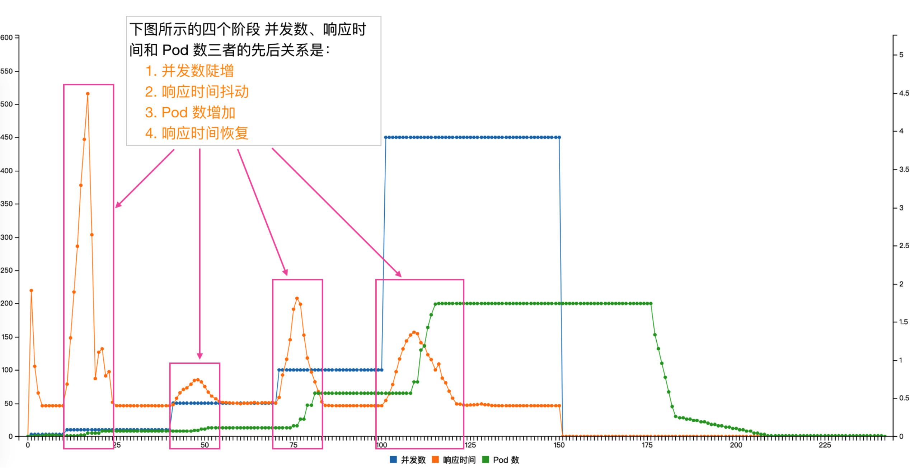

## 压测结果展示


## 编译
代码中自带 Makefile，直接执行 `make` 即可完成编译。
也可以执行 ./build/build-image.sh 自动编译镜像

## 使用方法：

```
time knload --stages=3:10,10:30,50:30,100:30,450:50  --service-url=httpload-server.default.example.com?sleep=400 --gateway-address=39.97.31.219:80 --save-path=/tmp/index.html --namespace=default --label='app=httpload-server' -v 5
```

参数解释：
- --stages

表示分几个阶段进行压测。 3:10,10:30,50:30,100:30,450:50 的意思是
  - 3qps 持续 10s
  - 10qps 持续 30s
  - 50qps 持续 30s
  - 100qps 持续 30s
  - 450qps 持续 50s

注意 knload 压测的策略是固定的每秒发起指定数量的请求，无论上一秒的请求是否处理完成，下一秒都会照常发起预设的请求. 所以如果之前的请求迟迟不响应就会导致请求的堆积，这也是衡量 Autoscaler 的一个重要指标

- --service-url

表示压测的 url, knload 主要目的是测试 Knative 的 Autoscaler 效率，所以这个 url 应该是 Knative Service 的 address

- --gateway-address 

表示网关地址, knload 内部自动实现 host 绑定访问目标 service

- --save-path

knload 压测的过程中 knload 会采集如下三个数据：1. 每一个请求的 rt 2. 每一个秒开始时的 Pod 数量 3. 记录当前的并发数.
压测过程中会输出一个 html 文件，这个问题直接通过浏览器打开就能看到并发数、rt 和 Pod 数量的关系

- --namespace 和 --label

knload 压测是 通过 --namespace  和  --namespace 采集 Pod 数量


